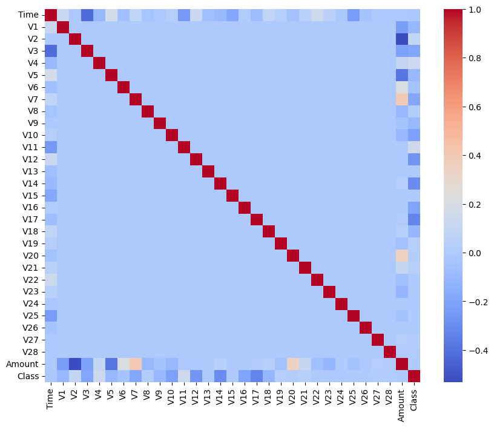
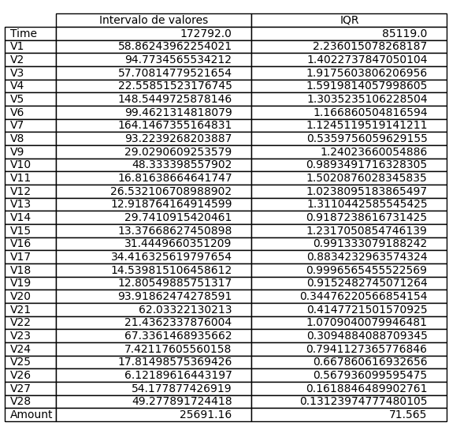

# 1. Informações do dataset Credit Card Fraud Detection e das Análises e Métodos de Data Science

## 1.1. Sumário

- [1. Informações do dataset Credit Card Fraud Detection e das Análises e Métodos de Data Science](#1-informações-do-dataset-credit-card-fraud-detection-e-das-análises-e-métodos-de-data-science)
  - [1.1. Sumário](#11-sumário)
  - [1.2. Informações do Dataset](#12-informações-do-dataset)
  - [1.3. Métodos e Análises de Data Science](#13-métodos-e-análises-de-data-science)
    - [1.3.1. Métodos de Balanceamento de Classes](#131-métodos-de-balanceamento-de-classes)
      - [1.3.1.1. Possíveis Visualizações](#1311-possíveis-visualizações)
        - [1.3.1.1.1. Gráfico de Barras](#13111-gráfico-de-barras)
        - [1.3.1.1.2. Gráfico de Dispersão (Scatter Plot)](#13112-gráfico-de-dispersão-scatter-plot)
      - [1.3.1.2. Amostragem Aleatória de Sobreamostragem (Random Over Sampling)](#1312-amostragem-aleatória-de-sobreamostragem-random-over-sampling)
      - [1.3.1.3. Amostragem Aleatória de Subamostragem (Random Under Sampling)](#1313-amostragem-aleatória-de-subamostragem-random-under-sampling)
      - [1.3.1.4. SMOTE (Synthetic Minority Over-sampling Technique)](#1314-smote-synthetic-minority-over-sampling-technique)
      - [1.3.1.5. Borderline SMOTE](#1315-borderline-smote)
      - [1.3.1.6. ADASYN (Adaptive Synthetic Sampling)](#1316-adasyn-adaptive-synthetic-sampling)
    - [1.3.2. Detecção de Anomalias](#132-detecção-de-anomalias)
    - [1.3.3. Análises Superficiais](#133-análises-superficiais)
    - [1.3.4. Machine Learning](#134-machine-learning)

## 1.2. Informações do Dataset

O conjunto de dados de fraude de cartão de crédito no Kaggle é um conjunto de dados altamente desequilibrado que contém transações feitas por cartões de crédito em setembro de 2013 por titulares de cartões europeus. Este conjunto de dados apresenta transações que ocorreram em dois dias, onde temos 492 fraudes de 284.807 transações. O conjunto de dados é altamente desequilibrado, a classe positiva (fraudes) é de 0,172% de todas as transações.

Ele contém apenas variáveis de entrada numéricas que são o resultado de uma transformação PCA. Infelizmente, devido a questões de confidencialidade, não são fornecidas as características originais e mais informações básicas sobre os dados. As características V1, V2, ... V28 são os principais componentes obtidos com o PCA, as únicas características que não foram transformadas com o PCA são 'Time' e 'Amount'. A característica 'Time' contém os segundos decorridos entre cada transação e a primeira transação no conjunto de dados. A característica 'Amount' é a quantidade da transação, essa característica pode ser usada para aprendizado sensível ao custo dependente do exemplo. A característica 'Class' é a variável de resposta e leva o valor 1 em caso de fraude e 0 em caso contrário.

## 1.3. Métodos e Análises de Data Science

### 1.3.1. Métodos de Balanceamento de Classes

O balanceamento de classes é uma técnica crucial no aprendizado de máquina, especialmente em cenários onde estamos lidando com conjuntos de dados desequilibrados. Um conjunto de dados é considerado desequilibrado quando as distribuições de classes não são aproximadamente iguais. Em outras palavras, um conjunto de dados desequilibrado tem uma classe majoritária (ou classes) e uma classe minoritária (ou classes) com proporções significativamente diferentes.

A importância do balanceamento de classes é evidente em muitos cenários do mundo real. Por exemplo, na detecção de fraude de cartão de crédito, a classe de "fraude" é geralmente a classe minoritária (uma pequena proporção de todas as transações são fraudulentas), enquanto a classe de "não fraude" é a classe majoritária. Se o modelo for treinado em um conjunto de dados desequilibrado, ele pode se tornar tendencioso para a classe majoritária, resultando em um grande número de falsos negativos. Em outras palavras, o modelo pode falhar em detectar muitos casos de fraude, o que é um resultado indesejável.

O balanceamento de classes ajuda a mitigar este problema, garantindo que o modelo de aprendizado de máquina seja exposto a uma proporção adequada de exemplos de cada classe. Isso pode ser feito de várias maneiras, incluindo sobreamostragem da classe minoritária, subamostragem da classe majoritária, ou gerando exemplos sintéticos da classe minoritária.

No entanto, é importante notar que o balanceamento de classes não é sempre necessário e pode, às vezes, até prejudicar o desempenho do modelo. Por exemplo, em alguns casos, a classe minoritária pode ser de interesse, mas não necessariamente mais importante que a classe majoritária. Além disso, o balanceamento de classes pode levar a um sobreajuste na classe minoritária se não for feito corretamente.

Em resumo, o balanceamento de classes é uma técnica importante para lidar com conjuntos de dados desequilibrados, mas deve ser aplicado com cuidado, levando em consideração o contexto específico e os objetivos do problema de aprendizado de máquina.

#### 1.3.1.1. Possíveis Visualizações

A visualização de dados é uma parte fundamental da análise de dados e pode ser particularmente útil ao lidar com problemas de balanceamento de classes. Aqui estão algumas visualizações de gráficos que podem ser úteis:

##### 1.3.1.1.1. Gráfico de Barras

Um gráfico de barras é uma forma eficaz de comparar itens entre diferentes grupos. Este tipo de gráfico é uma maneira fácil de interpretar e representar dados categorizados. No contexto do balanceamento de classes, um gráfico de barras pode ser usado para visualizar a quantidade de instâncias em cada classe. Isso pode ajudar a identificar rapidamente se um conjunto de dados está desequilibrado.

Cada barra no gráfico representa uma classe, e a altura da barra é proporcional ao número de instâncias dessa classe. Assim, é fácil ver qual classe tem mais instâncias (a classe majoritária) e qual tem menos (a classe minoritária).

##### 1.3.1.1.2. Gráfico de Dispersão (Scatter Plot)

Um gráfico de dispersão é um diagrama onde cada valor do conjunto de dados é representado por um ponto. Este tipo de gráfico pode ser útil para visualizar a relação entre duas variáveis. No contexto do balanceamento de classes, um gráfico de dispersão pode ser usado para visualizar a distribuição das instâncias de cada classe em relação a duas características.

Cada ponto no gráfico representa uma instância, e a posição do ponto é determinada pelos valores das duas características. Você pode colorir os pontos de acordo com a classe, o que pode ajudar a visualizar como as instâncias de cada classe estão distribuídas.

#### 1.3.1.2. Amostragem Aleatória de Sobreamostragem (Random Over Sampling)

Este método ajuda a equilibrar as classes aumentando o número de instâncias na classe minoritária. Ele faz isso duplicando as instâncias existentes da classe minoritária de forma aleatória. Embora seja uma maneira eficaz de equilibrar as classes, pode levar ao overfitting, pois as mesmas instâncias são repetidas.

#### 1.3.1.3. Amostragem Aleatória de Subamostragem (Random Under Sampling)

Este método equilibra as classes reduzindo o número de instâncias na classe majoritária. Ele faz isso eliminando instâncias da classe majoritária de forma aleatória. Embora seja eficaz em equilibrar as classes, pode levar à perda de informações importantes, pois algumas instâncias da classe majoritária são removidas.

#### 1.3.1.4. SMOTE (Synthetic Minority Over-sampling Technique)

Este método gera instâncias sintéticas da classe minoritária em vez de criar cópias exatas. Ele seleciona duas ou mais instâncias semelhantes da classe minoritária e perturba uma instância ao longo da linha que conecta as instâncias. Isso cria uma instância "sintética" que aumenta a classe minoritária enquanto adiciona mais variação ao conjunto de dados.

#### 1.3.1.5. Borderline SMOTE

Este método é uma variação do SMOTE que gera instâncias sintéticas apenas das instâncias da classe minoritária que estão próximas da fronteira de decisão (ou seja, aquelas que são mais difíceis de classificar). Isso ajuda a melhorar a capacidade do modelo de generalização, pois fornece mais exemplos de casos difíceis de classificar.

#### 1.3.1.6. ADASYN (Adaptive Synthetic Sampling)

Este método é semelhante ao SMOTE, mas com uma diferença importante: ele dá mais peso às instâncias que são difíceis de classificar. Ele faz isso gerando mais instâncias sintéticas das instâncias da classe minoritária que são mais difíceis de classificar. Isso ajuda a direcionar o modelo para aprender mais sobre as áreas problemáticas do espaço de entrada.

### 1.3.2. Outliers, Anomalias e Conjuntos vazios

#### Detecção de Outliers

Outliers e anomalias são pontos de dados incomuns ou excepcionais em um conjunto de dados. No contexto de um dataset de fraude de cartão de crédito, esses valores atípicos podem ter um impacto significativo nas análises e na detecção de atividades fraudulentas. Vamos entender melhor o que são e quais são os impactos de outliers e anomalias nesse tipo de dataset

Os outliers são valores extremos que se desviam significativamente da maioria dos dados em um conjunto. Eles podem surgir devido a erros de registro, falhas nos sistemas ou até mesmo representar casos genuinamente raros. Ao analisar dados de fraude de cartão de crédito, os outliers podem distorcer métricas estatísticas, como a média e o desvio padrão, afetando a interpretação dos dados e influenciando negativamente a eficácia dos modelos de detecção de fraudes. Identificar e lidar adequadamente com os outliers é essencial para garantir a precisão das análises.

As anomalias, por sua vez, são padrões de dados que não seguem as características típicas ou esperadas do conjunto. Em um dataset de fraude de cartão de crédito, as anomalias podem representar transações fraudulentas, que diferem significativamente do comportamento normal do titular do cartão. A detecção dessas anomalias é crucial para identificar atividades suspeitas e proteger os clientes e instituições financeiras contra fraudes. Os métodos de detecção de anomalias, como aprendizado de máquina e técnicas estatísticas, desempenham um papel fundamental nesse processo.

Impactos de Outliers e Anomalias em um Dataset de Fraude de Cartão de Crédito:

Detecção de Fraudes:
Outliers e anomalias podem afetar a capacidade de detectar fraudes de cartão de crédito de maneira eficiente. Outliers mal tratados podem levar a falsos positivos ou falsos negativos nos modelos de detecção, resultando em perdas financeiras para os clientes ou para a instituição financeira.

Previsões Precisas:
A presença de outliers pode distorcer as previsões feitas por modelos preditivos, tornando-os menos precisos. Isso pode levar a uma falta de confiança nos resultados e afetar a capacidade de tomar decisões informadas com base nas análises.

Tomada de Decisão:
Outliers e anomalias podem influenciar negativamente a tomada de decisões ao causar desvios nas análises e interpretações dos dados. Ações inadequadas podem ser tomadas com base em informações distorcidas, impactando a eficiência e a segurança das operações financeiras.

Monitoramento Contínuo:
Um dataset de fraude de cartão de crédito está em constante evolução, e novos padrões de fraude podem surgir ao longo do tempo. O monitoramento contínuo e a detecção ágil de outliers e anomalias são cruciais para se adaptar às novas ameaças e manter a eficácia dos sistemas de prevenção de fraudes.

Veremos alguns métodos estastíticos de detecção de outliers

##### Z-Score & Robust Z-score

O Z-score e o Robust Z-score são duas técnicas estatísticas amplamente utilizadas para identificar outliers em um conjunto de dados. Ambos os métodos comparam a diferença entre um ponto de dados e a média do conjunto com a variabilidade dos dados para determinar o quão incomum ou atípico esse ponto é em relação aos demais.

Rodando Z-score e Robust Z-score do dataset, podemos verificar a porcentagem de outliers encontrada em cada feature.

Podemos ver que esses métodos detectaram bastante outliers em V11, enquanto os dois perceberam pouco em Time e Amount

##### IQR

IQR (Interquartile Range) é uma medida estatística usada para detectar e identificar outliers em um conjunto de dados. Ele fornece uma maneira robusta de avaliar a dispersão dos valores em torno da mediana e é menos sensível a valores extremos do que outras medidas, como a média e o desvio padrão.

Podemos analisar então denovo as features para encontrar outliers usando o IQR

Podemos ver que o IQR é menos sensível à outliers pela quantidade encontrada em geral, mas ele também destaca o atributo V11.

##### Winsorization (Percentile Capping)

A abordagem do Percentile Capping consiste em definir um limite superior e/ou inferior para os valores do conjunto de dados, substituindo os outliers que ultrapassam esses limites pelos próprios limites. Isso ajuda a mitigar o impacto desses valores atípicos na análise estatística, tornando os dados mais robustos e realistas.

Porém vamos apenas detectar os outliers acima do 99% e abaixo dos 1%, ou seja, vamos encontrar os valores que estão no extremo da distribuição.

##### Análise dos outliers

No nosso dataset de fraude, outliers e anomalias ajudam a detectar e analisar fraudes, podemos justificar as repostas de modelo de IA analisando os outliers do dado classificado como fraude e então dizer que aquela transação é uma fraude pois contém um conjuto de dados que são outliers sendo uma anomalia.

Vamos ver quantos outliers os métodos

Usando a matrix de correlação entre as features

Percebemos que a feature V11 tem uma correlação positiva com a classe, ou seja, quando maior o V11 mais provável que a classe seja fraude
Temos então a opção de tratar esses outliers afim de prover dados que melhorem a performace de modelos de IA

#### Tratamentos

##### Remoção

##### Transformação

###### Scalling

###### Log Transformation

###### Cube Root Normalization

###### Box-Cox Transformation

##### Imputation

#### Detecção de Anomalias

##### Isolation Forest

##### Local Outlier Factor

##### One-Class SVM

##### Robust Convariance

### 1.3.3. Análises Superficiais

Análises Superficiais são um dos primeiros passos ao análisar um dataset, com o intuito de ganhar uma noção de como os dados estão distribuidos, quais são as tendências, os picos e o formato em geral do gráfico. Essas informações são importantes para que as análises futuras e suas interpretações sejam bem interpretados e que os potenciais problemas sejam tratados corretamente. Garantindo assim, uma alta qualidade analítica.

#### Média, Mediana e Moda

Média é o valor da soma e divisão pelo numeros de dados de cada feature. Ele representa o valor central em que os dados tendem a se juntar.
Com ela é possível entender a tentência central dos dados e descobrir outliers.

A mediana é o valor médio, média do maior valor com o menor. Ela é menos sensível à outliers e também é possível decobrir se os dados estão simetricamente distribuídos. Para cada features, as medianas são:

Por fim, a moda é o valor que mais se repete no dataset, sendo a que tem a maior frequência. Com ela, pode-se analisar os picos de distribuição.

#### Valores extremos (Zero, máx , min e vazio)

Ao analisar um dataset, é importante verificar se os dados estão bem organizados, assim, em certos casos, zeros e valores faltantes são indesejáveis e é necessario trata-los.

No nosso dataset de fraude, os dados já são de certa forma tratados e não possuem nenhum valor faltando ou zeros com exceção da feature Time, aonde zero é o momento exato que foi começado o registro das compras.

Os valores máximos e mínimos conseguem mostrar o range dos dados e quais são os limites do dataset. Os valores para cada features são

#### Desvio Padrão

O desvio padrão é a medida da dispersão de dados em volta da média, quando possui um valor alto, indica uma variedade maior dos dados e quando tiver um valor menor, dados mais próximos da média. O desvio pode ser usado como medida para outliers e para mostrar a variedade

#### Amplitudes

A amplitude dos dados é bem sensível à outliers, porém são importantes para análise da disperção dos dados.

#### Skewness e Kurtosis

Skewness é a assimetria da distribuição do dataset. Um valor positico significa uma calda mais longa na direita do gráfico, enquando negativa é maior na esquerda.
Podemos verificar se os dados são simetricos se o valor do skew for próximo de zero, e o impacto na média e mediana, já que um skew positivo faz com que a média tenda a ser maior que a mediana e vice versa.

Kurtosis mede o peso da calda do gráfico de distribuição da feature comparado com a normal. Ela indica se os dados possuem valores extremos (outliers) ou são próximos da média. Quando o valor é alto (leptokurtic) indica uma calda pesada com vários outliers, e quando baixo (platykurtic) uma distruição plana com caldas leves e quando zero os dados são iguais a normal.

#### Matrix de Correlação

Com essa matrix conseguimos visualizar e tirar alguns insights de como as features estão correlacionadas. Primeiro com o dataset puro sem nenhum tratamento de classe disbalanceada.

Os pares de features que são mais positivamente correlacionados são [V6, Amount], [Amount, V20 ], [V20, Amount], [Amount, V7], [V7, Amount]
e os pares mais negativamente correlacionados são [V2, Amount],[Amount, V2], [V3, Time], [Time, V3], [V5, Amount]

No entanto, o disbalancemento faz com que essas relações não sejam muito confiáveis, para isso, vamos aplicar o smote no dataset e rever as correlações

Assim nos descobrimos essas relações positivas:
[V18, V16], [V17, V18], [V18, V17], [V17, V16], [V16, V17]
negativas:
[V12, V11], [V11, V12], [V14, V11], [V11, V14], [V3, V2]
### 1.3.4. Machine Learning

Machine Learning é uma abordagem da inteligência artificial que permite sistemas computacionais aprendam padrões, reconheçam informações ocultas e façam previsões em novos dados.

Para a ciência de dados, Machine Learning tem importância pela capacidade de lidar com enormes volumes de dados e encontrar insights complexos que são difíceis de encontrar por humanos.

Para o nosso dataset de cartão de crédito, Machine Learning é capaz de extrair e identificar comportamentos suspeitos, transações anomalas ou fora do padrão e quais os fatores que influenciam na decisão de fraude ou não.

Além de podermos usar os modelos para classificar novos dados em tempo real, nós usaremos para visualizar e identificar as features do dataset que são mais influentes.

#### 1.3.4.1 Entendo metricas e gráficos

Métricas são ferramentas essenciais na avaliação do desempenho de modelos de machine learning em tarefas de classificação. Quatro métricas amplamente utilizadas são a precision, recall, F1 e support. A precision é a proporção de verdadeiros positivos em relação ao total de predições positivas, medindo a precisão do modelo em identificar corretamente instâncias positivas. O recall, por outro lado, é a proporção de verdadeiros positivos em relação ao total de instâncias positivas reais, medindo a capacidade do modelo em encontrar todas as instâncias relevantes. A métrica F1 é a média harmônica entre precision e recall, fornecendo um equilíbrio entre ambas, sendo especialmente útil quando há um desequilíbrio de classes no conjunto de dados. O support representa o número de ocorrências reais de cada classe no conjunto de dados.

Além das métricas, gráficos são uma maneira eficaz de visualizar o desempenho e as características do modelo. O gráfico de feature importance destaca a importância relativa de cada atributo ou variável para as decisões do modelo, ajudando a identificar as principais contribuições para a classificação. A matriz de confusão é um gráfico tabular que compara as classificações reais com as predições do modelo, mostrando o número de verdadeiros positivos, verdadeiros negativos, falsos positivos e falsos negativos. Esse gráfico é especialmente útil para entender o desempenho do modelo em cada classe, bem como para detectar erros comuns de classificação. Essas métricas e gráficos são fundamentais para uma avaliação completa e aprimoramento contínuo de modelos de data science.

#### 1.3.4.2 Regressão logística

#### 1.3.4.3 Árvore de decisão

#### 1.3.4.4 Random Forest

#### 1.3.4.5 XGBoost

XGBoost (Extreme Gradient Boosting) é uma técnica de aprendizado de máquina amplamente utilizada para problemas de classificação, regressão e outros tipos de tarefas de análise de dados. Ele ganhou muita popularidade devido ao seu alto desempenho, eficiência computacional e capacidade de lidar com conjuntos de dados complexos.

A ideia principal por trás do XGBoost é combinar várias árvores de decisão simples em um modelo mais robusto e poderoso. Essa abordagem é conhecida como "boosting" (impulsionamento) e visa corrigir os erros cometidos pelas árvores anteriores, melhorando gradualmente a precisão do modelo. O "Gradient Boosting" refere-se ao uso de gradientes (derivadas) para otimizar a estrutura das árvores de decisão em cada iteração, reduzindo o erro de predição.

Usando o SMOTE para balancear nosso dados, podemos treinar um modelo de XGBoost e verificar os resultados do treinamento e teste. Treinando por 100 rounds em 5 minutos temos:

Acurácia do treino: **100%**

Classification Report:
            Não Fraude  Fraude    accuracy  macro avg  weighted avg
precision       1.0       1.0       1.0        1.0           1.0
recall          1.0       1.0       1.0        1.0           1.0
f1-score        1.0       1.0       1.0        1.0           1.0
support    199166.0  198875.0       1.0   398041.0      398041.0

Matrix de Confusão:

Acurácia do teste: **99,99%**

Classification Report:
              Não Fraude      Fraude   accuracy      macro avg     weighted avg
precision      1.000000      0.999743  0.999871       0.999871       0.999871
recall         0.999742      1.000000  0.999871       0.999871       0.999871
f1-score       0.999871      0.999871  0.999871       0.999871       0.999871
support    85149.000000  85440.000000  0.999871  170589.000000  170589.000000

Matrix de Confusão:

Podemos também verificar quais features o modelo julgou serem mais importantes com o gráfico de Feature Importance.

Pelo gráfico, podemos ver que a feature V14 é a que mais é levada em consideração com mais de 60% de importância, seguido de V4, V12 e V17. Sendo V27 a feature menos impactante.

Por último, temos como visualizar a última árvore gerada pelo modelo.

#### 1.3.4.6 LightGBM

#### 1.3.4.7 Support Vector Machine (SVM)

#### 1.3.4.8 Auto Encoder
